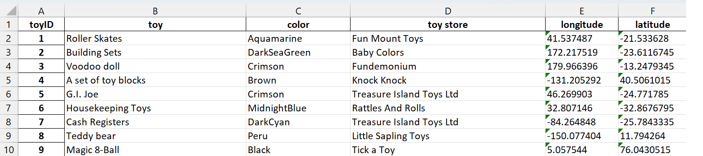

# Christmas Geekster 2022
Information and Data about the Geekster in CSU NL - Christmas Edition

## Datasets

This project includes several datasets that are related to Santa and his requests for this Christmas. The datasets are provided in different file formats and can be used for working on the given use cases or, optionally, creating new ones.

### People

The **people.xlsx** dataset contains the addresses (in longitude and latitude) of people with a certain name and date of birth.

You can see a preview of data in the following image:

### Toy stores

The **toy_stores.xlsx** dataset contains the toy name, color, toy store and location (in longitude and latitude) of a certain store.

You can see a preview of data in the following image:

### Additional datasets

This project also includes additional datasets [insert information about any other datasets included in the project]. For more information about these datasets, [insert instructions for accessing or working with the datasets].

## Use cases

1. 
2. 