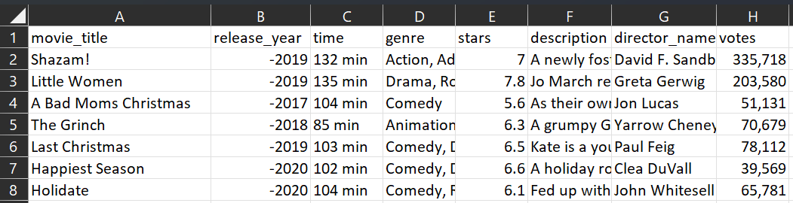
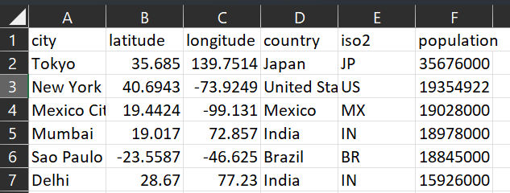

# Christmas Geekster 2022
Information and Data about the Geekster in CSU NL - Christmas Edition.

Documents contains 2 sections: Datasets and Use cases

## 1. Datasets

This project includes several datasets that are related to Santa and his requests for this Christmas. The datasets are provided in different file formats and can be used for working on the given use cases or, optionally, creating new ones.

### Christmas Movies
The **christmas_movies.xlsx** contains title of the movie, release year, length of the movie, genre, stars, description, director's name, votes. Contains 279 rows.

You can see a preview of data in the following image:

### People

The **people.xlsx** dataset contains the addresses (in longitude and latitude) of people with a certain name and date of birth. Contains 5000 rows. 

You can see a preview of data in the following image:

### Toy stores

The **toy_stores.xlsx** dataset contains the toy name, color, toy store and location (in longitude and latitude) of a certain store.  Contains 5000 rows.  

You can see a preview of data in the following image:

### World Cities
The **world_cities_dataset.xlsx** contains city, country, city's latitude and longitude, country code, and city's population. Contains 15494 rows.

You can see a preview of data in the following image:

### Additional datasets

This project also includes additional datasets [insert information about any other datasets included in the project]. For more information about these datasets, [insert instructions for accessing or working with the datasets].

## 2. Use cases

1. 
2. 
