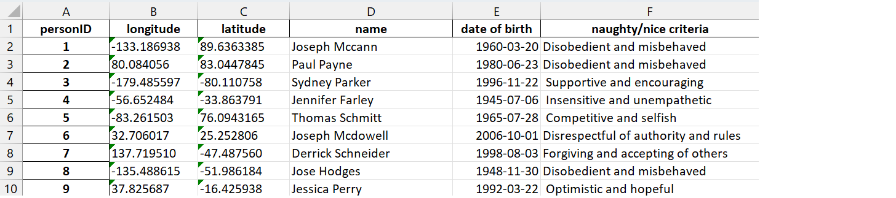

# Christmas Geekster 2022
Information and Data about the Geekster in CSU NL - Christmas Edition.

Documents contains 2 sections: Datasets and Use cases

## 1. Datasets

This project includes several datasets that are related to Santa and his requests for this Christmas. The datasets are provided in different file formats and can be used for working on the given use cases or, optionally, creating new ones.

### Christmas Movies
The **christmas_movies.xlsx** contains title of the movie, release year, length of the movie, genre, stars, description, director's name, votes. Contains 279 rows.

You can see a preview of data in the following image:

### People

The **people.xlsx** dataset contains the addresses (in longitude and latitude) of people with a certain name and date of birth and the type of behaviour that they've had during the past year. Contains 5000 rows. 

You can see a preview of data in the following image:

### Recipes

The **recipes.json** dataset contains the Name, details and methods of different recipes. Contains 1617 objects. 

You can see a preview of data in the following image:

### Toy stores

The **toy_stores.xlsx** dataset contains the toy name, color, toy store and location (in longitude and latitude) of a certain store.  Contains 5000 rows.  

You can see a preview of data in the following image:

### World Cities
The **world_cities_dataset.xlsx** contains city, country, city's latitude and longitude, country code, and city's population. Contains 15494 rows.

You can see a preview of data in the following image:

### Additional datasets

The folder **presents_pictures** also contains images of potential gifts. There are 32 images

## 2. Use cases

1.  I want to know how long it will take me to get from one destination to the other.
2.	Some children don't know what they want for Christmas! Help me choose a gift for an undecisive child.
3.	I want to have my own Advent calendar with a movie recommendation for each day, so that me and Ms. Santa can sip hot cocoa and watch cozy movies. 
4.	I want to know which toy store is closest to a child, so that my reindeer fly efficiently. 
5.	I would like to have the ability to talk to the children (e.g., queue-based app)
6.	I want to have a virtual wish list manager so that I and my elves can keep track of the gifts that children around the world are asking for.

### Resources
1. https://patterns.greensoftware.foundation/
2. https://sci-data.greensoftware.foundation/ 
3. https://learn.microsoft.com/en-us/azure/architecture/framework/sustainability/sustainability-get-started
